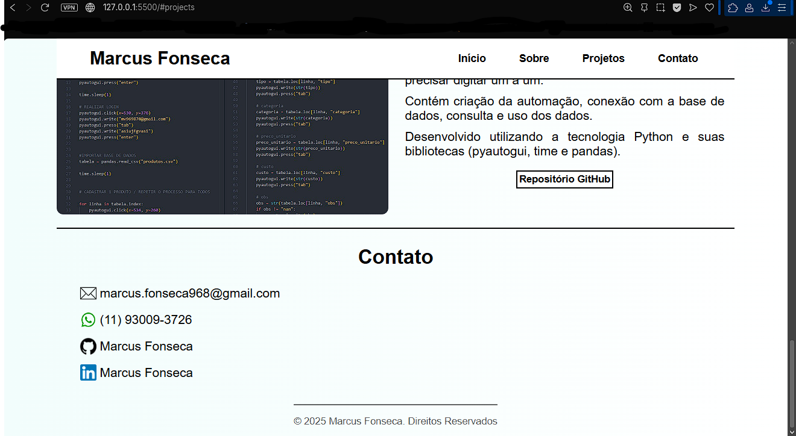
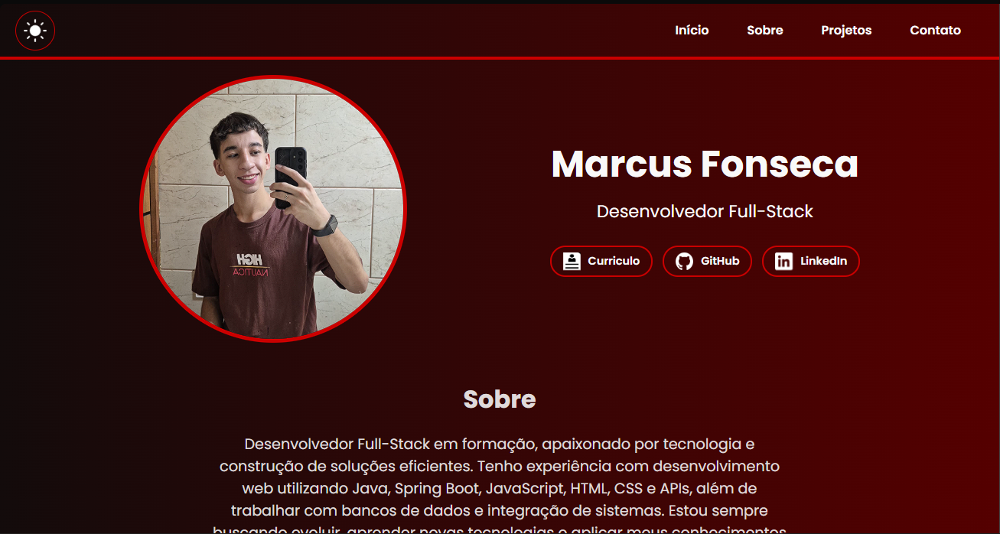
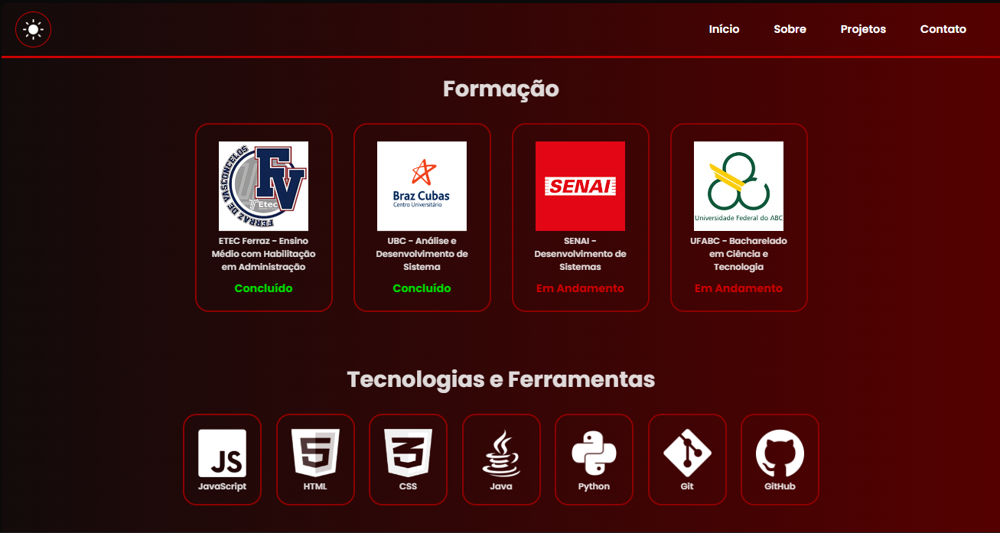
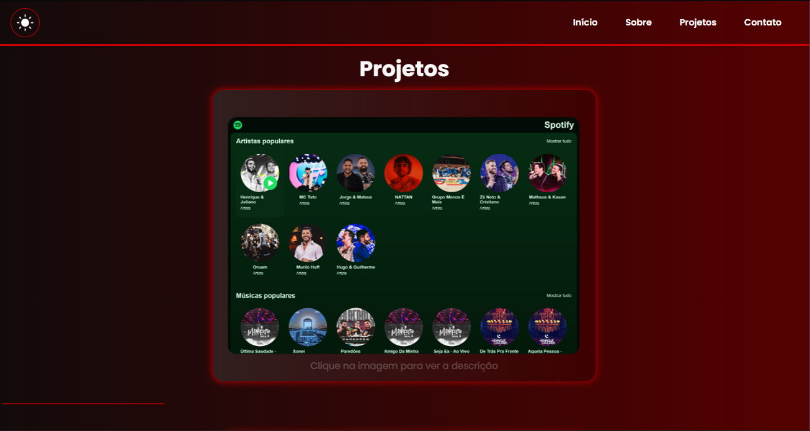
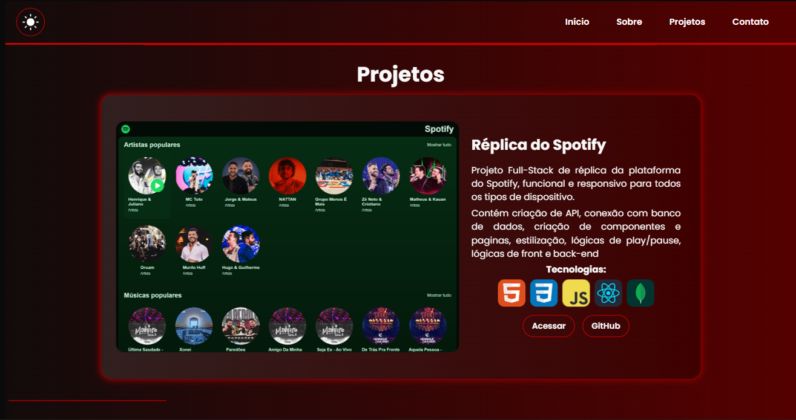
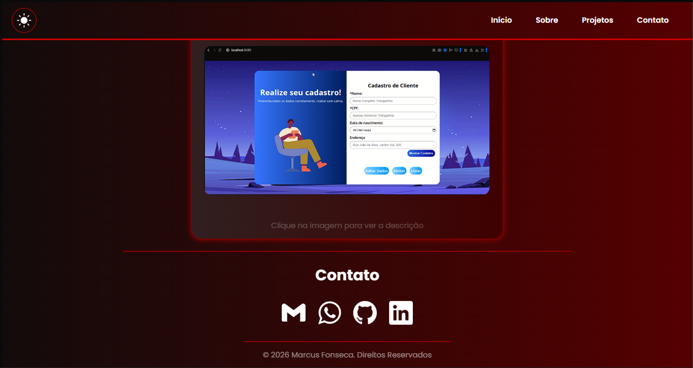
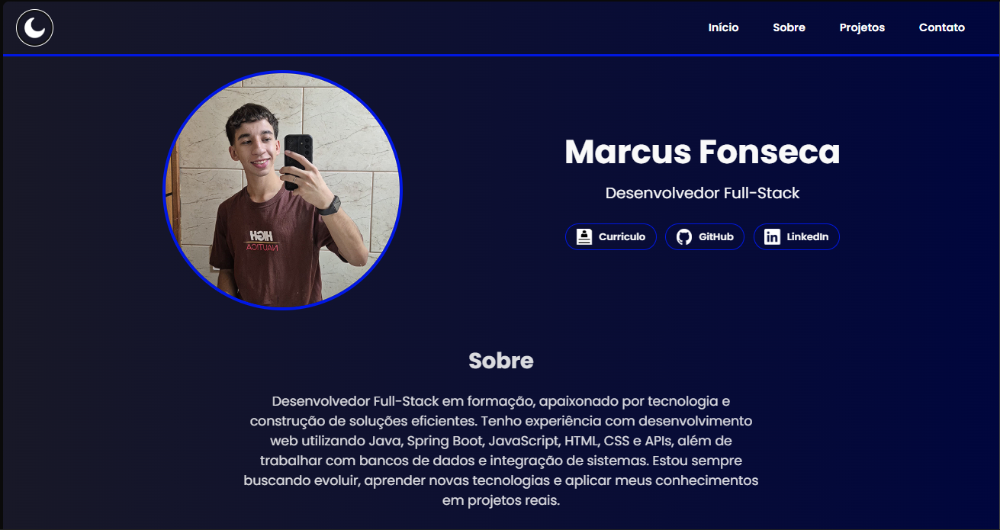

# 📁 Portfolio Pessoal
## 📌 Sobre o Projeto

Este projeto é a atualização do meu portfólio pessoal, originalmente desenvolvido no ano passado durante meu processo inicial de aprendizado.

Com a evolução dos meus conhecimentos em desenvolvimento web, estou reformulando completamente a estrutura, o design e as boas práticas aplicadas, buscando um resultado mais profissional, organizado e moderno.

## 🚀 Tecnologias Utilizadas

- <p>  </p>

- <p>  </p>

- <p>  </p> 

## 🎯 Objetivo

- Aplicar estruturação semântica correta

- Melhorar organização e legibilidade do código

- Implementar um design mais moderno

- Melhorar a responsividade do projeto

- Adicionar interatividade com JavaScript

## 📚 Evolução Aplicada

- Uso adequado de ```<header>, <main>, <section>, <article> e <footer>```

- Hierarquia correta de títulos

- Separação organizada de arquivos

- Estrutura mais limpa e escalável

- Melhores práticas de CSS

## 💡 Propósito

Além de servir como apresentação profissional, este projeto representa minha evolução como desenvolvedor e meu compromisso com aprendizado contínuo e boas práticas.

## 🤔 Como estava antes??

<div align="center">



</div>


## 🤩 Como ficou??

<div align="center">






<br>
  <p> Modo Claro: </p>

</div>


## 😆 Quer ver funcionando??
Visite meu post no LinkedIn que contém um vídeo demonstrativo: <a href="https://www.linkedin.com/posts/marcusfonseca7_html-css-javascript-activity-7449963498383663104-5hsW?utm_source=share&utm_medium=member_desktop&rcm=ACoAAEtWFbMBOCSeWEax5VMb0NGD5w3cE8VyC0Q"> Vídeo no LinkedIn </a> 

Logo mais estará disponível para acesso...
